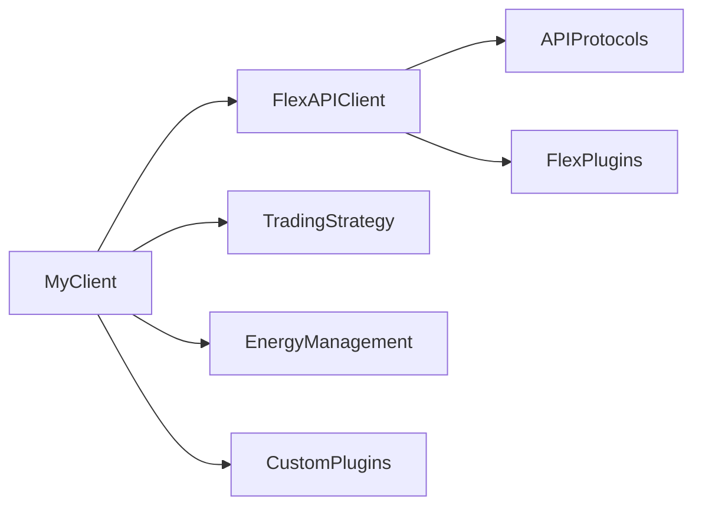

<!-- [](https://img.shields.io/github/v/release/glocalflex/flxtrd)
[](https://github.com/glocalflex/flxtrd/actions/workflows/main.yml?query=branch%3Amain)
[](https://img.shields.io/github/commit-activity/m/glocalflex/flxtrd) -->

<!-- [](https://img.shields.io/github/license/glocalflex/flxtrd) -->


# GLocalFlexTrade Public API

Public client API for the flexible energy trading market GLocalFlex.
The client libary provides standard interface to access the GLocalFlex Market public API.
The client integrates Rest API and AMPQ protocol for communication with the GLocalFlex marketplace.


[](https://github.com/glocalflex/GLocalFlexTrade/actions/workflows/main.yml?query=branch%3Amain)
[](https://codecov.io/gh/glocalflex/GLocalFlexTrade)
[](https://img.shields.io/github/commit-activity/m/glocalflex/GLocalFlexTrade)
[](https://img.shields.io/github/license/glocalflex/GLocalFlexTrade)


The GLocalFlexTrade client API [Documentation](https://glocalflex.github.io/GLocalFlexTrade/) provides more information how to use the **flxtrd** Python package.

The official **GLocalFlex Market**  [API Documentation](https://www.glocalflexmarket.com/docs/) gives an overview and more details of the public API and energy trading platform.


## Architecture

The basic functionality of the client is to send market orders to the GLocalFlex Market server and receive market responses. The API client is designed to be used in a trading client application.
It is up to the user which additional functionalities are implemented to the client. As an example a trading strategy and energy management logic can be integrated to the client.



## Quickstart Guide

Install GLocalFlexTrade Python package

```sh
pip install flxtrd
```

### Basic trading client example

```py
"""Example usage of the trading client using AMPQ protocol"""
from logging import ERROR, INFO
import sys

from flxtrd import (
    ASK,
    BID,
    FlexAPIClient,
    FlexResource,
    FlexMarket,
    MarketOrder,
    FlexUser,
    log,
    utils,
)


def main() -> None:
    GLOCALFLEX_MARKET_URL = "glocalflexmarket.com"

    user = FlexUser(name="<your_email>",
                    password="<your_password>",
                    access_token="<your_device_access_token>",
                    )

    market = FlexMarket(market_url=GLOCALFLEX_MARKET_URL)

    # Create a AMPQ client that connects to the message broker
    trading_client = FlexAPIClient(user=user,
                                   market=market
                                   )

    # Define a flexibility resource that will be traded
    # The resource is a 100W power for 60 minutes starting in 5 minutes
    flex_resource = FlexResource(power_w=100,
                                 start_time_epoch_s=utils.utc_timestamp_s() + utils.min_to_s(5),
                                 duration_min=60,
                                 order_expiration_min=50)

    # Create a market ask order to sell flexibility
    market_order = MarketOrder(order_type=ASK,
                               price_eur=100,
                               resource=flex_resource)

    # Send the market order to the message broker
    # The connection to the broker will be initiated automatically
    _, err = trading_client.send_order(market_order=market_order)

    if err: log(ERROR, err); sys.exit(1)

    # Create a market bid order to buy flexibility
    market_order = MarketOrder(order_type=BID,
                               price_eur=100,
                               resource=flex_resource)

    _, err = trading_client.send_order(market_order=market_order)

    if err: log(ERROR, err); sys.exit(1)

    # Check the market responses for closed_deals, price tick messages
    # from the message broker for 60 seconds and exit
    wait_sec = 0
    expected_responses = 3
    log(INFO, f"Waiting for messages from market broker")

    try:
        while wait_sec < 60:
            market_responses = trading_client.check_market_responses()
            if market_responses is not None:
                log(INFO, f"Received {len(market_responses)} responses from market broker")
                # Close the connection to the market message broker
                if len(market_responses) == expected_responses:
                    break

            # Use instead of time.sleep() to allow message broker connection to stay alive
            trading_client.sleep(1)
            wait_sec += 1

    except KeyboardInterrupt:
        log(INFO, "Keyboard interrupt received. Closing connection to the market broker")
    finally:
        trading_client.disconnect()


if __name__ == "__main__":
    main()

```


### Basic REST API client example

```py
"""Example usage of the REST API client"""
from logging import ERROR, INFO
from pprint import pformat
import time
import sys

from flxtrd import (
    ASK,
    BID,
    FlexBroker,
    FlexAPIClient,
    FlexResource,
    FlexMarket,
    MarketOrder,
    FlexUser,
    log,
    utils,
)


def main() -> None:
    GLOCALFLEX_MARKET_URL = "glocalflexmarket.com"

    user = FlexUser(name="<your_email>",
                    password="<your_password>",
                    access_token="<your_device_access_token>"
                    )


    market = FlexMarket(market_url=GLOCALFLEX_MARKET_URL)

    # Create a AMPQ client that connects to the message broker
    trading_client = FlexAPIClient(user=user,
                                   market=market
                                   )

    # Send a request to the GLocalFlex with REST API
    response, err = trading_client.make_request(method="POST",
                                                endpoint="/users/login",
                                                data={"email": user.name, "password": user.password},
                                                )
    if err:
        log(ERROR, err)

    log(INFO, pformat(response.request_response.json()))
    log(INFO, response.request_response.status_code)


if __name__ == "__main__":
    main()

```


## Listen to market ticker messages
Example usage of the trading client to just listen to market ticker messages

```py

from logging import ERROR, INFO

from flxtrd import (
    FlexAPIClient,
    FlexMarket,
    FlexUser,
    log,

)

def main() -> None:
    GLOCALFLEX_MARKET_URL = "glocalflexmarket.com"

    user = FlexUser(name="<your_email>",
                    password="<your_password>",
                    access_token="<your_device_access_token>"
                    )
    market = FlexMarket(market_url=GLOCALFLEX_MARKET_URL)

    # Create a AMPQ client that connects to the message broker
    trading_client = FlexAPIClient(user=user,
                                   market=market,
                                   )

    
    trading_client.connect()

    # Check the market responses for closed_deals, price tick messages
    # from the message broker for 60 seconds and exit
    wait_sec = 0
    expected_responses = 1
    log(INFO, f"Waiting for ticker messages from marketplace")


    while True:
        log(INFO, f"Waited {wait_sec} seconds")
        market_responses = trading_client.check_market_responses()
        if market_responses is not None:
            log(INFO, f"Received {len(market_responses)} responses from market broker")
            # Close the connection to the market message broker
            if len(market_responses) == expected_responses:
                break
            
        trading_client.sleep(1)
        wait_sec += 1
        
    trading_client.disconnect()


if __name__ == "__main__":
    try:
        main()
    except KeyboardInterrupt:
        log(INFO, "Keyboard interrupt received. Closing connection to the market broker")
```